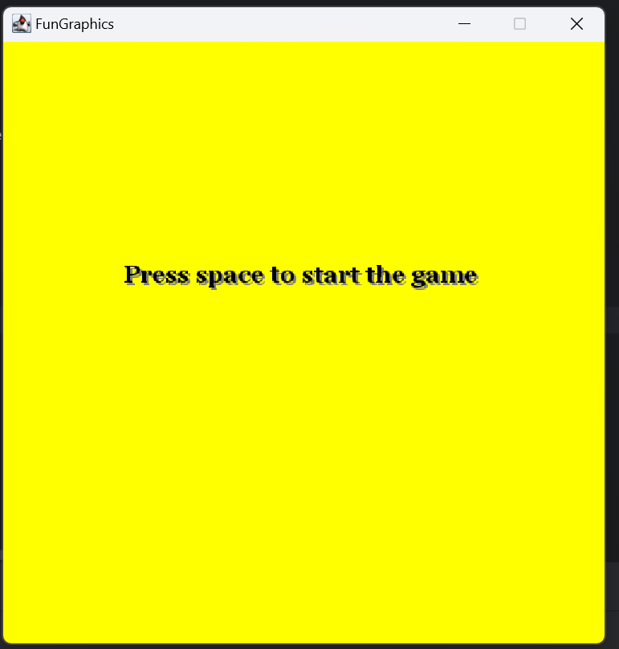
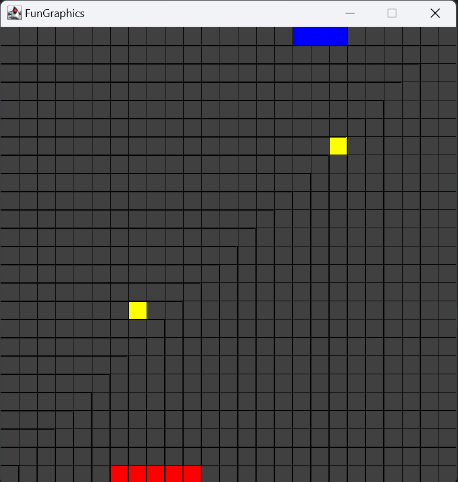
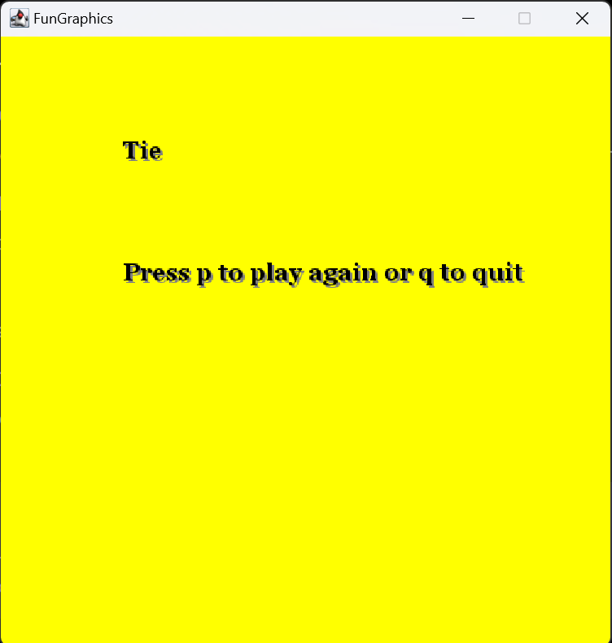

# 1 vs 1 Snake Game in Scala

## Description
This is a 1 vs 1 Snake Game developed in Scala using the FunGraphics library. Two players compete in a classic snake game, trying to grow their snake longer than their opponent while avoiding obstacles.

## Features
- 2-player gameplay.
- Awesome sound design made by a talentless independent artist.

## Prerequisites
- Scala 2.13 or later.
- FunGraphics library.

## Installation
1. Clone the repository:
    - git clone https://github.com/LC12081999/Snake1V1
2. Open the project in your favorite IDE (InteliJ).
3. Run the project.

## How to Play
- Player 1 uses `WASD` keys for movement.
- Player 2 uses `Arrow` keys.
- Avoid colliding with the walls or the opponent's snake.
- Eat food to grow your snake.
- The first player to hit a wall or the other snake loses.

## Preview
Title screen

</img>

Game screen

</img>

End screen

</img>

